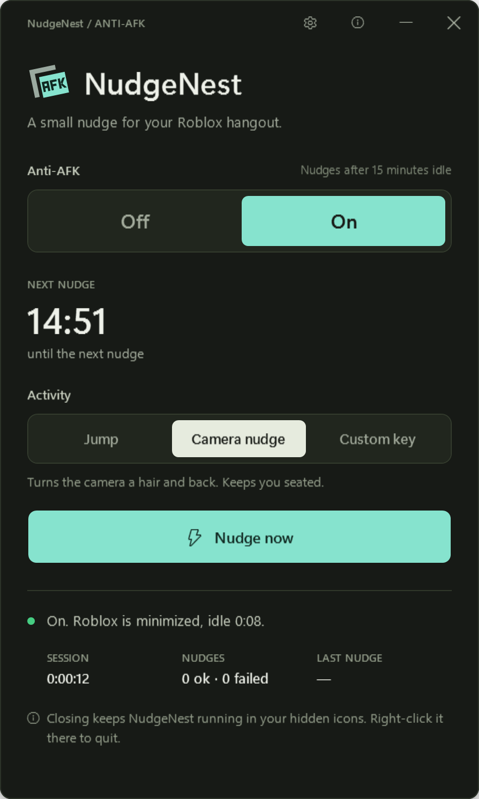

<p align="center">
  
</p>

<h1 align="center">NudgeNest</h1>

<p align="center">
  A free anti-AFK app for Roblox on Windows. Stay in the hangout and keep using your PC.<br>
  <a href="https://bloxnest.github.io/nudge-nest/">Website</a> ·
  <a href="https://github.com/bloxnest/nudge-nest/releases/latest/download/NudgeNest.exe">Download</a> ·
  <a href="PRIVACY.md">Privacy</a> ·
  <a href="SECURITY.md">Security</a>
</p>

<p align="center">
  
</p>

Roblox disconnects you after 20 minutes without input. NudgeNest sits in the tray and, once Roblox has
been idle for the time you pick, gives it the keyboard for about half a second, taps one key, and puts
everything back. Roblox can stay minimized while you use your PC.

Made by **xRed1**, also the developer of [BloxNest](https://bloxnest.github.io/).

## Features

- **Works minimized.** Your window goes back in front, Roblox goes back to minimized at the same size.
- **Smart AFK detection.** Only input that reaches Roblox counts. Typing in Chrome, Discord or VS Code
  doesn't reset the timer.
- **Stays out of your way.** A due nudge waits until you stop typing or clicking for 3 seconds, but never
  past 18 minutes (Roblox disconnects at 20).
- **Pick your nudge.** Jump (Space), a camera nudge that keeps you seated, or a custom key.
- **Auto start with Roblox.** Turns on when Roblox opens, goes on standby when it closes.
- **Checked after every nudge.** Focus, Roblox's state, position and size, and the mouse are verified.
  If something can't be put back, automatic nudging stops instead of interrupting you again.
- **No flicker.** A Roblox you can see is never made see-through.
- **Session stats and a small log** that never grows past about 256 KB.

## Safety

You don't have to take "safe" on trust. All of this can be checked:

- **Open source** under the [MIT license](LICENSE). Every line is in [`src/`](src).
- **No internet connections.** No accounts, telemetry or ads. See [PRIVACY.md](PRIVACY.md).
- **No injection.** NudgeNest never touches Roblox's files, memory or process. It only presses a key,
  like you would, using standard Windows input.
- **Built by GitHub.** Every release is built from this code by
  [GitHub Actions](.github/workflows/release.yml), with a SHA-256 checksum and a signed
  build-provenance attestation. Nobody uploads an exe by hand.
- **No admin rights**, one exe under 200 KB, under 30 MB of memory and no CPU while it waits in the tray.

Check a download:

```powershell
Get-FileHash .\NudgeNest.exe -Algorithm SHA256                 # compare with the release page
gh attestation verify NudgeNest.exe --repo bloxnest/nudge-nest  # needs the GitHub CLI
```

NudgeNest isn't code-signed yet, so Windows may say "Windows protected your PC". Choose **More info**,
then **Run anyway**.

## Good to know

- It can't nudge while the PC is locked (Win+L). The screen turning off is fine.
- The Microsoft Store version of Roblox isn't supported.
- NudgeNest isn't made or approved by Roblox, so nobody can promise anything about bans. Use it at your
  own risk.

## Build it yourself

You need Windows only; the C# compiler ships with it (.NET Framework 4).

```
build.bat              builds NudgeNest.exe
tests\run-tests.bat    builds and runs the 79 self-tests (about 3 minutes)
```

The self-tests drive the real engine against stand-in Roblox windows, never the real game. While they
run they move focus and the mouse around.

| Path | What's in it |
| --- | --- |
| `src/AntiAfkEngine.cs` | When to nudge: Roblox detection, smart AFK tracking, statistics |
| `src/Nudger.cs` | How to nudge: the focus hand-off and the keypress |
| `src/NudgeCheck.cs` | The checks after every nudge |
| `src/MainForm.cs` | The window (Main, Options, About) and the tray menu |
| `tests/` | Self-tests and the stand-in Roblox window |
| `docs/` | The website (GitHub Pages) |

## License

MIT © 2026 xRed1. Not affiliated with or endorsed by Roblox Corporation. Roblox is a trademark of
Roblox Corporation.
